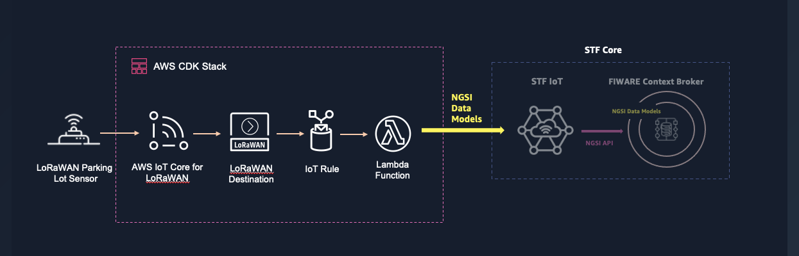
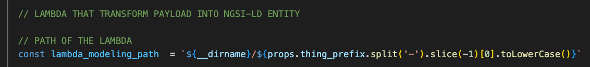
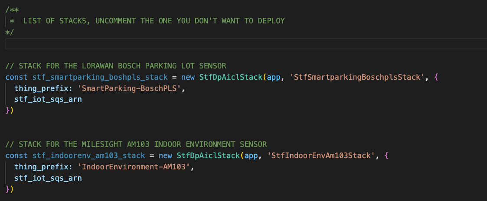
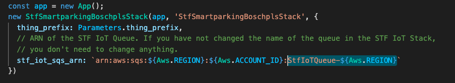
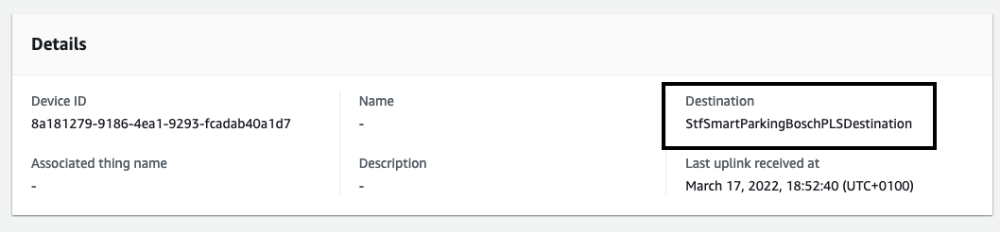

# Smart Territory Framework - Data Producer using AWS IoT Core for LoRaWAN

This repository contains a CDK application that deploys a stack of a Data Producer using AWS IoT Core for LoRaWAN to ingest data from LoRaWAN sensors.
This stack deploys the resources needed to ingest data from a LoRaWAN sensor using AWS IoT Core for LoRaWAN including: 

- The LoRaWAN destination that describes the AWS IoT Rule that routes the messages to the Lambda Function that processes the data. 
- The AWS IoT Rule that routes the messages to the Lambda Function. 
- The Lambda Function that decodes and transforms the payload using the NGSI-LD Smart Data Model relevant to the use case before publishing into the STF IoT Queue. You will need the ARN of the STF IoT Queue. *The default value of the ARN when deploying the STF IoT Stack is `arn:aws:sqs:${Aws.REGION}:${Aws.ACCOUNT_ID}:StfIoTQueue-${Aws.REGION}`. Unless you have changed the name of the Queue when deploying the STF IoT Stack, you have nothing to do.* 

<br>



<br>

You can deploy this same stack multiple times for distinct sensors. We include samples of payload decoders (Lambda Function) for various sensors and applications. You can find the Lambda Function that decodes and transform the payload for each sensor in the folder [`lib`](./lib/):  

- Smart Parking using [Bosch Parking Lot Sensor - PLS](https://www.bosch-connectivity.com/products/connected-mobility/parking-lot-sensor/downloads/). This stack uses the Smart Data Models [`ParkingSpot`](https://github.com/smart-data-models/dataModel.Parking/tree/master/ParkingSpot) 
- Indoor Environment Monitoring using [Milesight AM103](https://www.milesight-iot.com/lorawan/sensor/am103/). This stack uses the Smart Data Models [IndoorEnvironmentObserved](https://github.com/smart-data-models/dataModel.Environment/tree/master/IndoorEnvironmentObserved) including properties from [AirQualityObserved](https://github.com/smart-data-models/dataModel.Environment/tree/master/AirQualityObserved)
- Indoor Environment Monitoring using [Elsys ERS Sound](https://www.elsys.se/en/ers-sound/). This stack uses the Smart Data Models [IndoorEnvironmentObserved](https://github.com/smart-data-models/dataModel.Environment/tree/master/IndoorEnvironmentObserved) including properties from [AirQualityObserved](https://github.com/smart-data-models/dataModel.Environment/tree/master/AirQualityObserved)

The name of the stack and the function used is extracted from the `thing_prefix` used. For example, if you use the prefix `SmartParking-BoschPLS`, the stack will extract the last part of the prefix in lower case `boschpls` and will use the Lambda in the folder with the same name `boshpls`. 

<br>



<br>

## Prerequisites

<br>

To deploy this application, you need the following:
- An AWS account. If you don't have one, see [Set up an AWS account](https://docs.aws.amazon.com/greengrass/v2/developerguide/setting-up.html#set-up-aws-account).
- An AWS Identity and Access Management (IAM) user with administrator permissions
- AWS CDK Toolkit installed. See [Getting started with the AWS CDK](https://docs.aws.amazon.com/cdk/latest/guide/getting_started.html) to install it.
- [STF Core](https://github.com/aws-samples/aws-stf-core-scorpio) deployed. The following CDK application requires the ARN of the STF IoT Queue and the prefix used to register this type of sensors in the STF IoT registry. 

<br>

## Getting started 


This repository contains a CDK application that deploys a stack of a Data Producer to ingest data from LoRaWAN sensors using AWS IoT Core for LoRaWAN and publishes to [STF Core](https://github.com/aws-samples/aws-stf-core-scorpio).

You can deploy this stack multiple times for all the LoRaWAN sensors you want to connect. To deploy a stack you need to provide the prefix of the thing that will be registered in the STF IoT Registry and the SQS IoT Queue ARN. We provide samples for some sensors (see the list above). 

<br>



<br>

If you used a custom name for the STF IoT Queue when deploying the STF IoT stack, then you can update the ARN of the Queue accordingly in the file [`stf-dp-aicl.ts`](./bin/stf-dp-aicl.ts).

<br>



<br>

Once it is set up, you can deploy the application using the following commands: 

<br>

```
npm install
```

```
cdk bootstrap
```

```
cdk deploy --all
```

The name of the stack and the function used is extracted from the `thing_prefix` used. For example, if you use the prefix `SmartParking-BoschPLS`, the stack will extract the last part of the prefix in lower case `boschpls` and will use the Lambda in the folder with the same name `boshpls`. 

Once the stack is deployed you can [onboard]((https://docs.aws.amazon.com/iot/latest/developerguide/connect-iot-lorawan-onboard-end-devices.html)) your LoRaWAN sensors to AWS IoT Core for LoRaWAN. You will select the LoRa Destination created by this application (named `${thing_prefix}Destination`) when onboarding your devices.  

<br>



<br>

Voilà. You have everything ready. 

## Additional Resources

This section provides links to additional resources that may help deploy and operate this application: 

- [Getting started with AWS IoT Core for LoRaWAN](https://www.youtube.com/watch?v=6-ZrdRjqdTk). 
- [Bosch PLS Communication Interface - Technical Description](https://www.bosch-connectivity.com/media/product_detail_pls/parking_lot_sensor_pls_interface_description_v00_29_02_eu.pdf).
- [STF Core](https://github.com/aws-samples/aws-stf-core-scorpio).
- [AWS CDK Workshop](https://cdkworkshop.com/)
- [JSON-LD, NGSI-LD, Digital Twins and Smart Data Models](https://www.youtube.com/watch?v=dfigPKx99Bs)

## Security

See [CONTRIBUTING](CONTRIBUTING.md#security-issue-notifications) for more information.

## License

This library is licensed under the MIT-0 License. See the LICENSE file.

