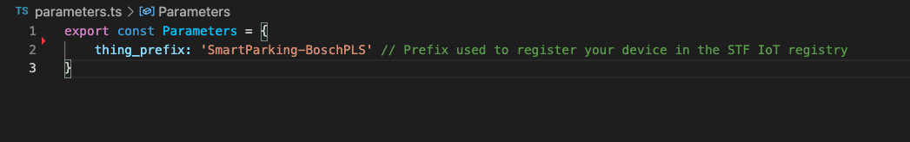

# Smart Territory Framework - Smart Parking - Bosch PLS

This repository contains a CDK application to deploy a Data Producer that ingests data from the Bosch PLS, LoRaWAN Parking Lot sensors, using AWS IoT Core for LoRaWAN. It decodes and transforms the payload using the NGSI-LD Smart Data Model [`ParkingSpot`](https://github.com/smart-data-models/dataModel.Parking/tree/master/ParkingSpot) before publishing into the STF IoT Queue.

We assume you have deployed the [STF Core](https://github.com/aws-samples/aws-stf-core-scorpio) (or at least the STF IoT module) before deploying the following stack. 

## Prerequisites
<br>

To deploy this application, you need the following:
- An AWS account. If you don't have one, see [Set up an AWS account](https://docs.aws.amazon.com/greengrass/v2/developerguide/setting-up.html#set-up-aws-account).
- An AWS Identity and Access Management (IAM) user with administrator permissions
- AWS CDK Toolkit installed. See [Getting started with the AWS CDK](https://docs.aws.amazon.com/cdk/latest/guide/getting_started.html) to install it.
- [STF IoT stack](https://github.com/aws-samples/aws-stf-core-scorpio) deployed. The following CDK application requires the ARN of the STF IoT Queue and the prefix used to register this type of sensors in the STF IoT registry (`SmartParking-BoschPLS` is used in this stack). 

<br>

## Overview 

This stack deploys the resources needed to ingest data from Bosch PLS parking lot sensors using AWS IoT Core for LoRaWAN including: 

- The LoRaWAN destination that describes the AWS IoT Rule that routes the messages to the Lambda Function that processes the data. 
- The AWS IoT Rule that routes the messages to the Lambda Function. 
- The Lambda Function that decodes and transforms the payload using the NGSI-LD Smart Data Model [`ParkingSpot`](https://github.com/smart-data-models/dataModel.Parking/tree/master/ParkingSpot) before publishing into the STF IoT Queue. You will need the ARN of the STF IoT Queue. *The default value of the ARN when deploying the STF IoT Stack is `arn:aws:sqs:${Aws.REGION}:${Aws.ACCOUNT_ID}:StfIoTQueue-${Aws.REGION}`. Unless you have changed the name of the Queue when deploying the STF IoT Stack, you have nothing to do.* 

<br>


<br>

## Getting started 

This repository contains an AWS CDK application that enables you to deploy a Data Producer that ingests data from the Bosch PLS, LoRaWAN Parking Lot sensors, using AWS IoT Core for LoRaWAN and publishes to [STF Core](https://github.com/aws-samples/aws-stf-core-scorpio).

The first step is to check, in the file [```parameters.ts```](./parameters.ts), the prefix you used or will use to register your Bosch PLS sensors in the STF IoT registry. The default one here is `SmartParking-BoschPLS-`.  

<br>



<br>

If you used a custom name for the STF IoT Queue when deploying the STF IoT stack, then you can update the ARN of the Queue accordingly in the file [`stf-smartparking-boschpls.ts`](./bin/stf-smartparking-boschpls.ts).

<br>


<br>

Once it is set up, you can deploy the application using the following commands: 

<br>

```
npm install
```

```
cdk bootstrap
```

```
cdk deploy
```

Once the stack is deployed you can [onboard]((https://docs.aws.amazon.com/iot/latest/developerguide/connect-iot-lorawan-onboard-end-devices.html)) your Bosch PLS sensors to AWS IoT Core for LoRaWAN. You will select the LoRa Destination created by this application (named `StfSmartParkingBoschPLSDestination`) when onboarding your devices.  

<br>


<br>

Voilà. You have everything ready. 

## Additional Resources

This section provides links to additional resources that may help deploy and operate this application: 

- [Getting started with AWS IoT Core for LoRaWAN](https://www.youtube.com/watch?v=6-ZrdRjqdTk). 
- [Bosch PLS Communication Interface - Technical Description](https://www.bosch-connectivity.com/media/product_detail_pls/parking_lot_sensor_pls_interface_description_v00_29_02_eu.pdf).
- [STF Core](https://github.com/aws-samples/aws-stf-core-scorpio).
- [AWS CDK Workshop](https://cdkworkshop.com/)
- [JSON-LD, NGSI-LD, Digital Twins and Smart Data Models](https://www.youtube.com/watch?v=dfigPKx99Bs)

## Security

See [CONTRIBUTING](CONTRIBUTING.md#security-issue-notifications) for more information.

## License

This library is licensed under the MIT-0 License. See the LICENSE file.

